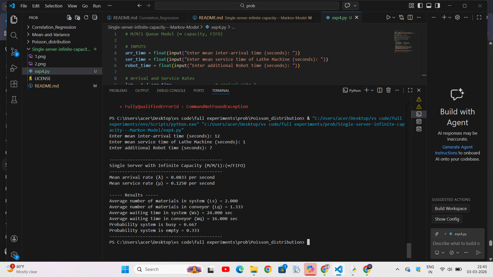

# Single server with infinite capacity (M/M/1):(oo/FIFO)
# DATE:03.03.2026
## Aim :
To find (a) average number of materials in the system (b) average number of materials in the conveyor (c) waiting time of each material in the system (d) waiting time of each material in the conveyor, if the arrival  of materials follow poisson process with the mean interval time 12 seconds, serivice time of lathe machine follows exponential distribution with mean serice time 1 second and average service time of robot is 7seconds.

## Software required :
Visual components and Python

## Theory:
Queuing are the most frequently encountered problems in everyday life. For example, queue at a cafeteria, library, bank, etc. Common to all of these cases are the arrivals of objects requiring service and the attendant delays when the service mechanism is busy. Waiting lines cannot be eliminated completely, but suitable techniques can be used to reduce the waiting time of an object in the system. A long waiting line may result in loss of customers to an organization. Waiting time can be reduced by providing additional service facilities, but it may result in an increase in the idle time of the service mechanism.


This is a queuing model in which the arrival is Marcovian and departure distribution is also Marcovian,number of server is one and size of the queue is also Marcovian,no.of server is one and size of the queue is infinite and service discipline is 1st come 1st serve(FCFS) and the calling source is also finite.

## Procedure :


 
## Program

```
arr_time = float(input("Enter mean inter-arrival time (seconds): "))
ser_time = float(input("Enter mean service time of Lathe Machine (seconds): "))
robot_time = float(input("Enter additional Robot time (seconds): "))

lam = 1 / arr_time                 
mu = 1 / (ser_time + robot_time)  

print("\n--------------------------------------------")
print("Single Server with Infinite Capacity (M/M/1):(∞/FIFO)")
print("--------------------------------------------")

print(f"Mean arrival rate (λ) = {lam:.4f} per second")
print(f"Mean service rate (μ) = {mu:.4f} per second")

if lam < mu:

    # M/M/1 formulas
    Ls = lam / (mu - lam)          
    Lq = lam**2 / (mu*(mu-lam))    
    Ws = 1 / (mu - lam)          
    Wq = lam / (mu*(mu-lam))       

    rho = lam / mu                

    print("\n----- Results -----")
    print(f"Average number of materials in system (Ls) = {Ls:.3f}")
    print(f"Average number of materials in conveyor (Lq) = {Lq:.3f}")
    print(f"Average waiting time in system (Ws) = {Ws:.3f} sec")
    print(f"Average waiting time in conveyor (Wq) = {Wq:.3f} sec")
    print(f"Probability system is busy = {rho:.3f}")
    print(f"Probability system is empty = {1-rho:.3f}")

else:
    print("\nWARNING: System is unstable (Arrival rate ≥ Service rate)")
    print("Queue will grow infinitely (Overflow condition)")

print("--------------------------------------------")
```

## Output :


## Result :
Hence the problem solved and got output with python successfully.

